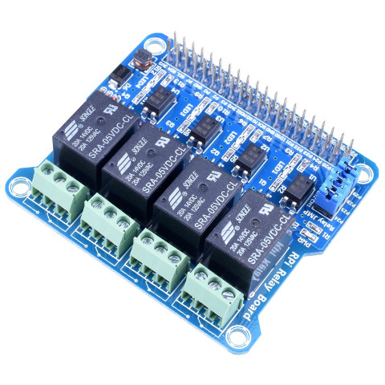

# rpi-relay-board
Micro library to control relay extension boards for the raspberry pi.



## example

```js
let relayBoard = new RelayBoard()
  .then(() => {
    console.log("Relay Board initialized!");
    console.log("Pulsing Channel 1");
    pulse(1);
  })
  .catch(console.error);

function pulse(channel, delay = 500) {
  relayBoard.set(channel)
  .then(() => {
    setTimeout(() => {
      relayBoard.reset();
    }, delay);
  })
  .catch(console.error);
}
```

## license

AGPL-3.0